<div align="center">

# 🏛️ Prāngan
### *Your Campus, Connected.*

**A Modern Cross-Platform Community Management Platform for Residential Societies & Campus Living**

[](https://flutter.dev)
[](https://dart.dev)
[](https://firebase.google.com)
[](https://flutter.dev/multi-platform)
[](LICENSE)

<br/>

> **Prāngan** (प्रांगण) — Sanskrit for *"courtyard"* or *"open gathering space"* — is a real-time, community-first mobile app that digitizes the communication, governance, events, and safety fabric of residential societies and campus communities.

</div>

---

## 📱 App Walkthrough & Screenshots

### 1️⃣ Authentication & Resident Onboarding

| 01. Splash Screen | 02. Welcome & Sign-In | 03. Join Society |
| :---: | :---: | :---: |
| 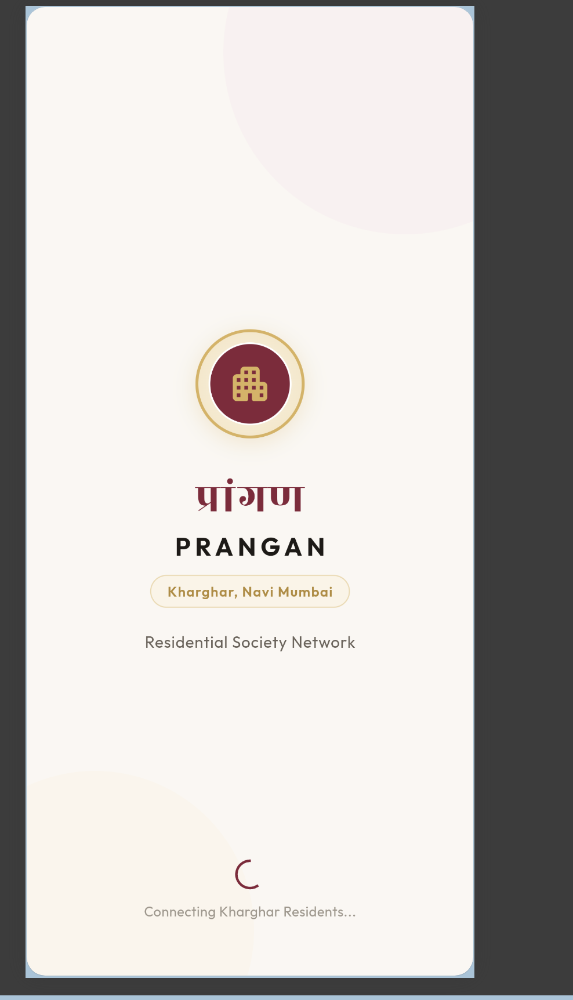 | 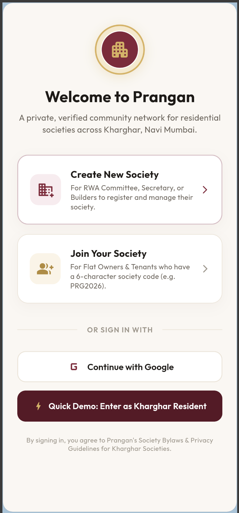 | 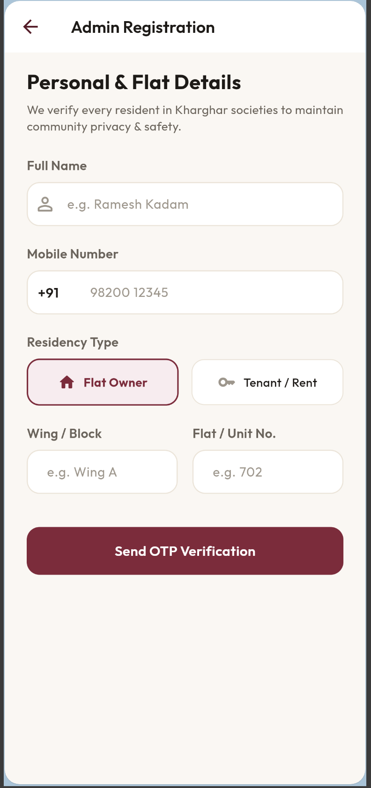 |
| *Custom branded crest with smooth fade transition* | *Google Sign-In & Email Authentication options* | *Search and select your campus / residential society* |

| 04. Confirm Resident Details | 05. Pending Admin Approval |
| :---: | :---: |
| 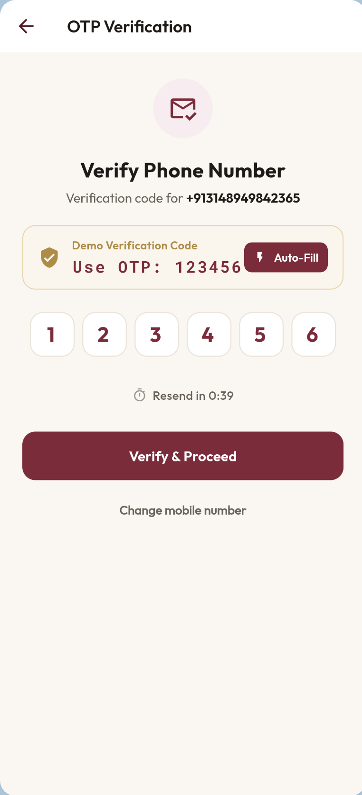 | 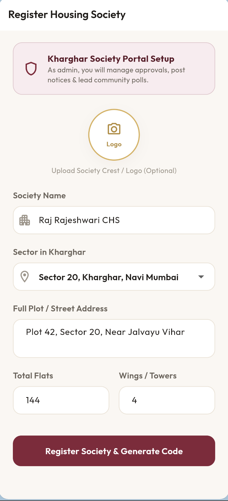 |
| *Fill wing, flat number & contact info* | *Real-time waiting screen; auto-unlocks when approved* |

---

### 2️⃣ Dashboard & Community Discussions

| 06. Society Dashboard | 07. Discussion Feed | 08. Create New Post | 09. Post Discussion & Comments |
| :---: | :---: | :---: | :---: |
| 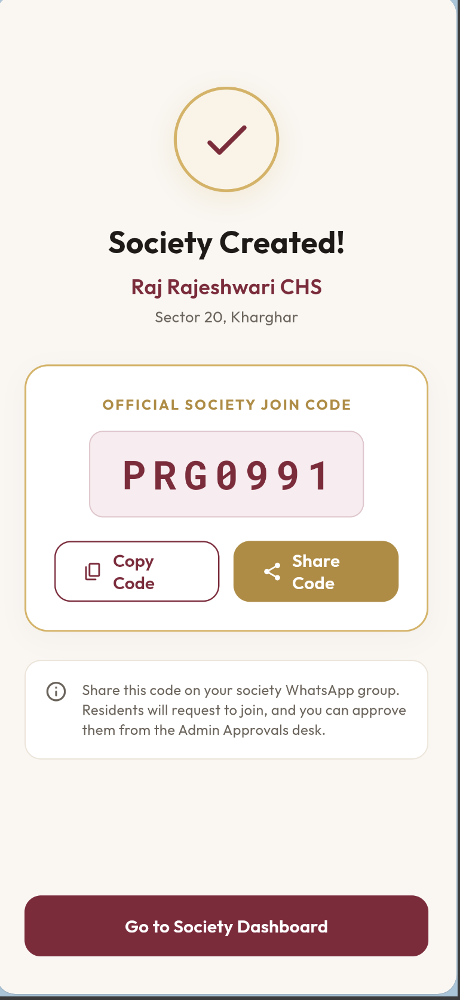 | 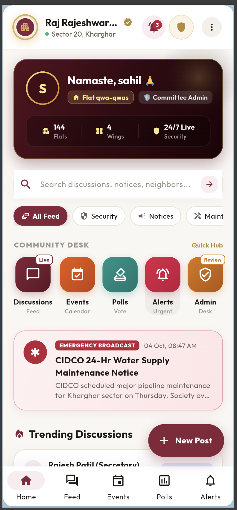 | 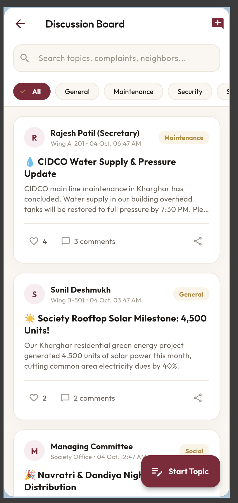 | 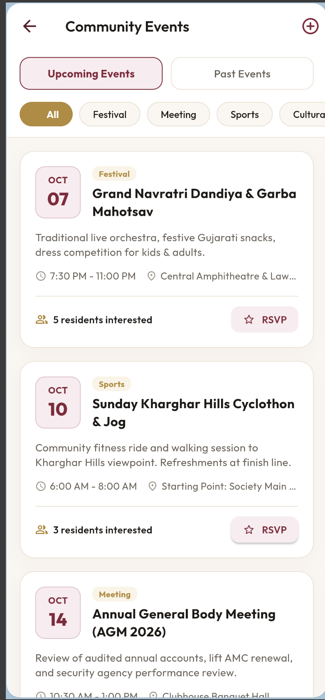 |
| *Society overview, quick actions & SOS alerts* | *Community issues, likes, comments & updates* | *Attach photos, add tags & broadcast issues* | *Threaded real-time comments & discussion* |

---

### 3️⃣ Events, Live Polls & Safety Broadcasts

| 10. Upcoming Events | 11. Live Community Polls | 12. Create New Poll |
| :---: | :---: | :---: |
| 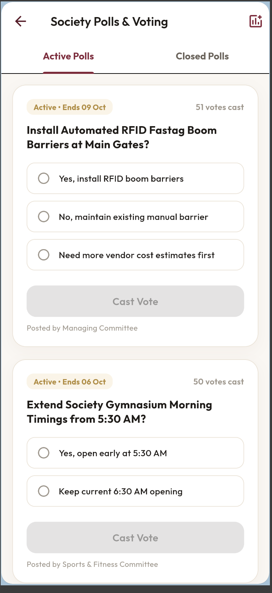 | 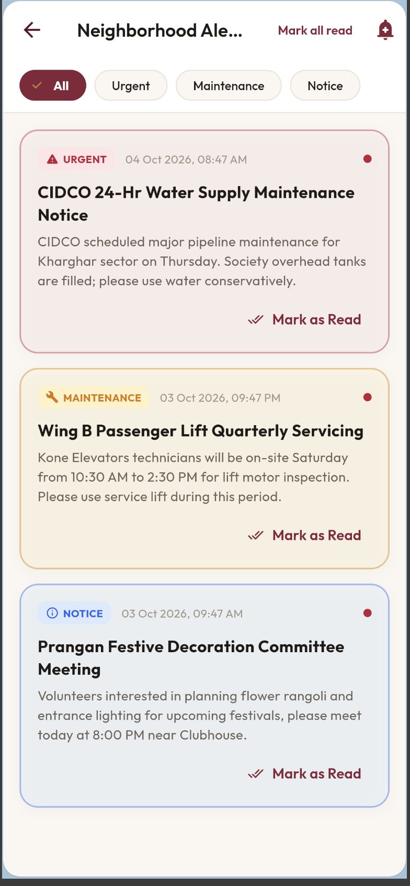 | 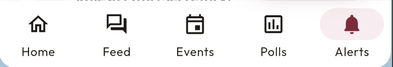 |
| *Meetings, festivals & community calendar* | *Democratic voting with live animated percentages* | *Admins can create multi-choice opinion polls* |

| 13. Society Notices & Alerts | 14. Emergency SOS Broadcast | 15. Admin Approval Panel |
| :---: | :---: | :---: |
| 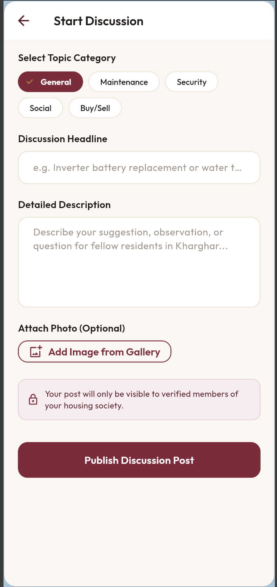 | 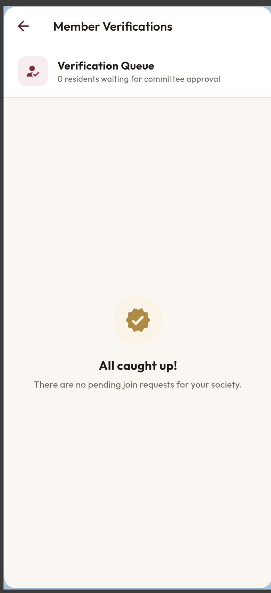 | 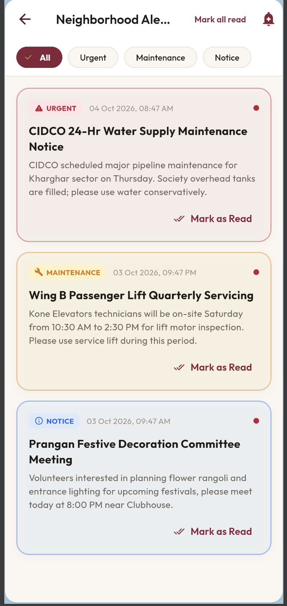 |
| *High-priority notices & maintenance alerts* | *Instant one-tap emergency alert broadcast* | *Admins review and approve/reject new residents* |

---

## 📑 Table of Contents

- [✨ Overview](#-overview)
- [🏗️ Architecture](#️-architecture)
- [🗂️ Project Structure](#️-project-structure)
- [📦 Tech Stack & Dependencies](#-tech-stack--dependencies)
- [🔥 Firebase & Data Modeling](#-firebase--data-modeling)
- [🔐 Authentication & User Roles](#-authentication--user-roles)
- [⚙️ Setup & Installation](#️-setup--installation)
- [🚀 Running the App](#-running-the-app)
- [🏗️ Build & Deployment](#️-build--deployment)
- [🎨 Design System](#-design-system)
- [🤝 Contributing](#-contributing)

---

## ✨ Overview

**Prāngan** is a full-stack Flutter application built for **Kharghar Society** (and extensible to any campus/residential community). It replaces fragmented WhatsApp groups, paper notice boards, and manual processes with a structured, role-based digital community platform.

### 🎯 Core Problems It Solves

| Problem | Prāngan's Solution |
|---|---|
| Scattered announcements across WhatsApp groups | Centralized **Notice Board** with real-time sync |
| Manual attendance & event tracking | Digital **Events Calendar** with RSVP & details |
| No formal grievance system | Community **Discussion Forum** with likes & comments |
| Slow emergency communication | One-tap **SOS Alert Broadcast** flashing red banner |
| No democratic decision-making tool | Live **Community Polls** with animated vote counts |
| Manual admin approval of new residents | Role-based **Admin Approval Workflow** with RBAC |

---

## 🏗️ Architecture

Prāngan follows a clean **MVVM (Model-View-ViewModel)** architecture with Flutter's `Provider` package for reactive state management.

```
┌──────────────────────────────────────────────────────────────┐
│                         UI LAYER                             │
│          lib/screens/  +  lib/widgets/                       │
│   (StatelessWidget / StatefulWidget — Pure UI rendering)     │
└─────────────────────────┬────────────────────────────────────┘
                          │ context.watch<T>() / Consumer<T>
┌─────────────────────────▼────────────────────────────────────┐
│                    VIEWMODEL LAYER                           │
│                    lib/providers/                            │
│   (ChangeNotifier — Business Logic + notifyListeners())      │
│   AuthProvider | SocietyProvider | PostProvider              │
│   EventProvider | PollProvider | AlertProvider               │
└─────────────────────────┬────────────────────────────────────┘
                          │ async calls
┌─────────────────────────▼────────────────────────────────────┐
│                     SERVICE LAYER                            │
│                    lib/services/                             │
│   (Raw Firebase API calls — No UI dependencies)              │
│   AuthService | SocietyService | PostService                 │
│   EventService | PollService | AlertService | StorageService │
└─────────────────────────┬────────────────────────────────────┘
                          │ Firestore SDK / Firebase Auth SDK
┌─────────────────────────▼────────────────────────────────────┐
│                    DATA / MODEL LAYER                        │
│                    lib/models/                               │
│   UserModel | SocietyModel | PostModel                       │
│   EventModel | PollModel | AlertModel                        │
│                  + Firebase Backend                          │
│            Cloud Firestore | Firebase Auth                   │
│         Firebase Storage | Google Sign-In                    │
└──────────────────────────────────────────────────────────────┘
```

### Key Architectural Decisions

- **`MultiProvider` at Root:** All 6 providers are injected at the app root in `main.dart`, making state globally accessible without prop-drilling.
- **Firestore Real-Time Streams:** The app uses `.snapshots()` (Dart `Stream`) for live-updating data (posts, polls, alerts) — not one-time `.get()` calls.
- **Service ↔ Provider Separation:** Services only know about Firebase. Providers only know about Services and UI state. Screens only know about Providers.

---

## 🗂️ Project Structure

```
prangan/
├── lib/
│   ├── main.dart                    # App entry point, MultiProvider setup
│   ├── firebase_options.dart        # Auto-generated Firebase platform config
│   │
│   ├── models/                      # Pure data schemas (Dart classes)
│   │   ├── user_model.dart          # UserModel (uid, name, role, status, societyId)
│   │   ├── society_model.dart       # SocietyModel (name, description, memberCount)
│   │   ├── post_model.dart          # PostModel (text, imageUrl, likes, comments)
│   │   ├── event_model.dart         # EventModel (title, date, venue, description)
│   │   ├── poll_model.dart          # PollModel (question, options, voteMap)
│   │   └── alert_model.dart         # AlertModel (message, severity, timestamp)
│   │
│   ├── services/                    # Firebase API abstraction layer
│   │   ├── auth_service.dart        # Google Sign-In, Email Auth, session management
│   │   ├── society_service.dart     # Society CRUD, member approval logic
│   │   ├── post_service.dart        # Post creation, like toggle, comment ops
│   │   ├── event_service.dart       # Event creation and fetching
│   │   ├── poll_service.dart        # Poll creation, vote casting
│   │   ├── alert_service.dart       # SOS broadcast, alert history
│   │   ├── storage_service.dart     # Firebase Storage image upload
│   │   └── seed_service.dart        # Dev-only data seeding utility
│   │
│   ├── providers/                   # State management (ChangeNotifier)
│   │   ├── auth_provider.dart       # Auth state, user profile, role management
│   │   ├── society_provider.dart    # Active society state, member management
│   │   ├── post_provider.dart       # Discussion feed state
│   │   ├── event_provider.dart      # Events list state
│   │   ├── poll_provider.dart       # Active polls state
│   │   └── alert_provider.dart      # Emergency alerts state
│   │
│   ├── screens/
│   │   ├── splash_screen.dart       # Entry screen with auth routing
│   │   ├── auth/                    # Welcome, Signup, OTP Verification
│   │   ├── society/                 # Join Society, Confirm Details, Pending Approval
│   │   ├── dashboard/               # Main Dashboard with quick actions & alerts
│   │   ├── discussions/             # Forum feed, New Post, Post Detail
│   │   ├── events/                  # Events calendar & details
│   │   ├── polls/                   # Live community voting
│   │   ├── alerts/                  # Notice board & emergency alerts
│   │   └── admin/                   # Member approvals & society management
│   │
│   ├── theme/
│   │   └── app_theme.dart           # Centralized Material 3 theme config
│   ├── widgets/                     # Custom reusable UI widgets (AppCrest, cards)
│   └── utils/                       # Formatters & helper utilities
│
├── assets/
│   └── screenshots/                 # 15 App walkthrough screenshots
├── android/                         # Android native config (minSdk 21, targetSdk 34)
├── ios/                             # iOS native config & CocoaPods
├── web/                             # Flutter Web runner
├── firestore.rules                  # Firestore security rules
├── firebase.json                    # Firebase project config
└── pubspec.yaml                     # Dependencies manifest
```

---

## 📦 Tech Stack & Dependencies

### Core Framework

| | Technology | Version |
|---|---|---|
| 🐦 | **Flutter SDK** | `^3.x` |
| 🎯 | **Dart SDK** | `^3.12.2` |
| 🎨 | **Material Design** | Material 3 (`useMaterial3: true`) |

### Firebase Backend

| Package | Version | Purpose |
|---|---|---|
| `firebase_core` | `^4.15.0` | Firebase SDK initialization for all platforms |
| `firebase_auth` | `^6.7.0` | User authentication, session persistence, token management |
| `cloud_firestore` | `^6.10.0` | NoSQL real-time database with offline caching |
| `firebase_storage` | `^13.6.0` | Cloud storage for images & media attachments |
| `google_sign_in` | `^7.2.0` | Native Google OAuth 2.0 sign-in flow |

### State Management & UI

| Package | Version | Purpose |
|---|---|---|
| `provider` | `^6.1.5` | Reactive state management (InheritedWidget wrapper) |
| `google_fonts` | `^8.2.1` | Outfit font family for modern typography |
| `image_picker` | `^1.2.3` | Camera & gallery access for post photos |

### Utilities

| Package | Version | Purpose |
|---|---|---|
| `intl` | `^0.20.3` | Date/time formatting (`DateFormat.yMMMd()`) |
| `shared_preferences` | `^2.5.5` | Local key-value storage for offline persistence |
| `share_plus` | `^13.3.0` | Native OS share sheet for notices & posts |
| `cupertino_icons` | `^1.0.8` | iOS-style icon set |

---

## 🔥 Firebase & Data Modeling

### Firestore Collections Schema

```
Firestore (NoSQL)
│
├── users/{uid}
│   ├── uid: String
│   ├── name: String
│   ├── email: String
│   ├── photoUrl: String?
│   ├── role: String          // "resident" | "admin"
│   ├── status: String        // "pending" | "approved" | "rejected"
│   └── societyId: String?
│
├── societies/{societyId}
│   ├── name: String
│   ├── description: String
│   ├── location: String
│   ├── adminUid: String
│   └── memberCount: int
│
├── posts/{postId}
│   ├── authorId: String
│   ├── authorName: String
│   ├── societyId: String
│   ├── content: String
│   ├── imageUrl: String?
│   ├── likes: List<String>        // UIDs of users who liked
│   ├── commentCount: int
│   └── createdAt: Timestamp
│
├── events/{eventId}
│   ├── title: String
│   ├── description: String
│   ├── venue: String
│   ├── date: Timestamp
│   └── societyId: String
│
├── polls/{pollId}
│   ├── question: String
│   ├── societyId: String
│   ├── options: List<String>
│   ├── votes: Map<String, String>  // { uid → optionIndex }
│   └── createdAt: Timestamp
│
└── alerts/{alertId}
    ├── message: String
    ├── severity: String            // "info" | "warning" | "sos"
    ├── societyId: String
    ├── createdBy: String
    └── createdAt: Timestamp
```

---

## 🔐 Authentication & User Roles

### Authentication Flow

```
App Launch → SplashScreen → FirebaseAuth.instance.currentUser?
    │
    ├── NULL ──► WelcomeScreen ──► Google/Email Auth
    │                                     │
    │                          Check Firestore /users/{uid}
    │                          ┌──────────┴──────────┐
    │                     New User?              Existing User?
    │                          │                      │
    │              Create doc (pending)        ┌──────┴──────┐
    │              JoinSocietyScreen      approved?       pending?
    │              PendingApproval         │               │
    │              (auto-unlocks)     Dashboard    PendingApproval
    │
    └── EXISTS ──► Check status & route
```

### User Roles & Permissions

| Role | Status | Access Level |
|---|---|---|
| `resident` | `pending` | Only the Pending Approval waiting screen |
| `resident` | `approved` | Dashboard, Discussions, Events, Polls, Alerts (view & interact) |
| `admin` | `approved` | All resident access + Admin Approvals Panel, Create Events, Create Polls, Broadcast SOS Alerts |

---

## ⚙️ Setup & Installation

### Prerequisites

```
✅ Flutter SDK  >= 3.x       →  https://docs.flutter.dev/get-started/install
✅ Dart SDK     >= 3.12.2    →  bundled with Flutter
✅ Android Studio / VS Code  →  with Flutter & Dart extensions
✅ Java 17                   →  required for Android Gradle 8.x
✅ Firebase Project          →  https://console.firebase.google.com
```

### Step 1 — Clone the Repository

```bash
git clone https://github.com/Sahilp2407/PRANGAN-.git
cd PRANGAN-
```

### Step 2 — Firebase Project Setup

1. Go to [Firebase Console](https://console.firebase.google.com/) and create a project named **Prangan**.
2. Enable these services:
   - **Authentication** → Google Sign-In + Email/Password
   - **Cloud Firestore** → Create database (test mode for dev)
   - **Firebase Storage** → Create default bucket
3. Register your apps (Android package: `com.prangan.app`, iOS bundle: `com.prangan.app`)
4. Download config files:
   - `google-services.json` → `android/app/google-services.json`
   - `GoogleService-Info.plist` → `ios/Runner/GoogleService-Info.plist`

### Step 3 — Add SHA-1 Fingerprint (Android Google Sign-In)

```bash
keytool -list -v \
  -keystore ~/.android/debug.keystore \
  -alias androiddebugkey \
  -storepass android -keypass android
```

Copy the **SHA-1** → Firebase Console → Project Settings → Android App → **Add Fingerprint** → re-download `google-services.json`.

### Step 4 — Install Dependencies

```bash
flutter pub get
```

### Step 5 — (iOS only) Install CocoaPods

```bash
cd ios && pod install && cd ..
```

---

## 🚀 Running the App

```bash
flutter devices                        # List connected devices
flutter run                            # Run on default device
flutter run -d "iPhone 15 Pro"         # Run on iOS Simulator
flutter run -d chrome                  # Run on Web browser
```

---

## 🏗️ Build & Deployment

```bash
# Debug APK (for quick testing)
flutter build apk --debug

# Release APK (optimized, AOT compiled)
flutter build apk --release

# App Bundle (Google Play Store)
flutter build appbundle --release

# iOS Release
flutter build ios --release
```

| Feature | Debug Build | Release Build |
|---|---|---|
| **Compilation** | JIT (Just-In-Time) | AOT (Ahead-Of-Time) |
| **Performance** | Slower, debug symbols | Optimized, smooth 60/120 FPS |
| **File Size** | ~40–60 MB | ~15–25 MB (tree-shaken) |
| **Code Security** | Readable | R8 / ProGuard obfuscated |
| **Signing** | `debug.keystore` | Custom production `key.jks` |

---

## 🎨 Design System

Prāngan features a **centralized Material 3 theme** in [`lib/theme/app_theme.dart`](lib/theme/app_theme.dart).

### Color Palette

| Token | Hex | Usage |
|---|---|---|
| **Heritage Crimson** | `#86243A` | Primary brand color, AppBar background |
| **Primary Dark** | `#5B1625` | Pressed states, dark surfaces |
| **Warm Gold** | `#DAB15C` | Accent, badges, highlights |
| **Neutral Cream** | `#FAF7F2` | Scaffold background |
| **Pure White** | `#FFFFFF` | Card & input surfaces |
| **Emergency Red** | `#D32F2F` | High-priority SOS alert banners |

### Typography

- **Font:** [Outfit](https://fonts.google.com/specimen/Outfit) via `google_fonts`
- All text styles globally mapped in `TextTheme` for clean visual hierarchy across all devices.

---

## 🤝 Contributing

1. Fork the repository
2. Create your branch: `git checkout -b feature/your-feature`
3. Commit: `git commit -m "feat: add your feature"`
4. Push: `git push origin feature/your-feature`
5. Open a Pull Request

```bash
flutter analyze   # Check for issues
dart format .     # Auto-format code
flutter test      # Run tests
```

---

## 📝 License

This project is licensed under the **MIT License**. See [LICENSE](LICENSE) for details.

---

<div align="center">

**Built with ❤️ using Flutter & Firebase**

*Prāngan — Bringing Communities Together, One Screen at a Time.*

</div>
